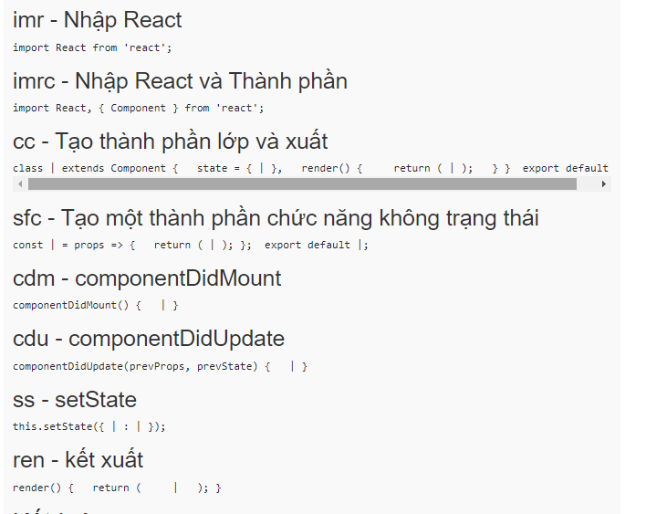

1. các bước bắt đầu dự án reactjs

-   tạo react-app : lệnh <npx create-react-app titok>
-   note: muốn đến code dự án trên vs code lệnh <code .>
-   note có thể đổi được post của project : + tạo thêm file : <.env.local> --> code: PORT=3001
-   đẩy lên github

2. Cài đặt customize-cra

-   create-react-app: sau lm project sẽ có 1 số trường hợp cần cấu hình dự án
-   thư viện customize-cra : - Giúp ghi đè cấu hình của webpack
-   lênh cài: yarn add customize-cra react-app-rewired --dev
-   với npm : <npm i customize-cra react-app-rewired -D> note cái ni được cài ở devDependencies
-   Tạo ra file :<config-overrides.js>

```
Create a config-overrides.js file in the root directory
/* config-overrides.js */

module.exports = function override(config, env) {
  //do stuff with the webpack config...
  return config;
}

```

-   Thay đổi trong nội dung trong scripts trong file package.json

```
 /* package.json */

  "scripts": {
-   "start": "react-scripts start",
+   "start": "react-app-rewired start",
-   "build": "react-scripts build",
+   "build": "react-app-rewired build",
-   "test": "react-scripts test",
+   "test": "react-app-rewired test",
    "eject": "react-scripts eject"
}
```

3. Cài đặt babel-plugin-module-resolver

-   truy cập vào trang web :

*   https://github.com/tleunen/babel-plugin-module-resolver
*   import ... from '.../.../.../...'

-   ---> mục đích cài ni để khi import sẽ ngắn ngọn <import thẳng đến thẻ con>

*   b1: cài đặt bằng lệnh : <npm install --save-dev babel-plugin-module-resolver>
*   b2: tạo ra thư mục :<.babelrc>-- với nội dung:

```
{
  "plugins": [
    [
      "module-resolver",
      {
        "alias": {
          "~": "./src"
        }
      }
    ]
  ]
}
```

-   sửa lại nội dung file: config-overrides.js

```
const { override, useBabelRc } = require("customize-cra");

module.exports = override(
    // eslint-disable-next-line react-hooks/rules-of-hooks
    useBabelRc()
);
```

-   tạo ra file :<jsconfig.json>

```
{
  "compilerOptions": {
    "baseUrl": ".",
    "paths": {
      "~/*": ["src/*"]
    }
  }
}
```

4. Cài đặt và cấu hình prettier:

-   cái ni giúp format lại các file <như file html , css, js>
-   để team lm cùng format

*   b1: tạo file:<.prettierrc>

```
{
    "arrowParens": "always",
    "bracketSameLine": false,
    "bracketSpacing": true,
    "embeddedLanguageFormatting": "auto",
    "htmlWhitespaceSensitivity": "css",
    "insertPragma": false,
    "jsxSingleQuote": false,
    "printWidth": 120,
    "proseWrap": "preserve",
    "quoteProps": "as-needed",
    "requirePragma": false,
    "semi": true,
    "singleQuote": true,
    "tabWidth": 4,
    "trailingComma": "all",
    "useTabs": false,
    "vueIndentScriptAndStyle": false
}
```

-   Tạo file : <.vscode/settings.json>

```
{
    "editor.formatOnSave": true,
    "editor.defaultFormatter": "esbenp.prettier-vscode"
}
```

-   vô các file: ctrl+s --> tự động format lại

5. Cấu hình sử dụng CSS/SASS
   < cấu hình và sử dụng thư viện SASS/CSS>

-   b1: tạo file component / GlobalStyles /index.js
-   b2: tạo function trong file index.js
-   b3: cài sass <npm i -D sass>
-   b4: reset CSS
    -   vào trang: <https://www.npmjs.com/package/css-reset-and-normalize>
    -   cài normalize.css: lệnh <npm i normalize.css>
    -   < cài xong kiểm tra xem có chưa trong thẻ <styles> ở <header>>
-   b5: default css:
    -   vào trang: <https://fonts.google.com/specimen/Montserrat+Alternates?subset=vietnamese> để lấy font

6.  Cấu hình Router/Layout cho dự án
    1.  Phân tích tổng quan Layout
    2.  Cài đặt react-router-dom
    -   lệnh cài <npm i react-router-dom>
    -   cài simple React Snippets <cái ni giúp viết code reactjs nhanh hơn>
    -   
    3.  Đưa cấu hình router ra ngoài
    4.  Xây dựng cơ chế tải layout

-

-   Vocabulary:

*   customize: tuỳ chỉnh
*   deploy: triển khai
*   config: cấu hình

-   tạo dự án với thư viện <create react app> dưới nền sử dụng thư viện web-package và tich hợp thư viện babel - để chuyển đổi cú pháp , cấu hình web-package k thể hiện <nên cài đặt thêm customize-cra ==> cái ni giúp ghi đè được cấu hình của web-package <cái ni k nhất thiết phải reject ra >>
-   note : sau mỗi lần cài đặt : vào package.json để kiểm tra
-   phím tắt : shift+alt + F <tự động cấu hình lại formmat >
-   note : cài đặt được ubuntu trên window

*   Viết tắt về wrap :

-   phím tắt :<ctrl+shift+P>-> gõ wrap A... -> thẻ cần wrap
